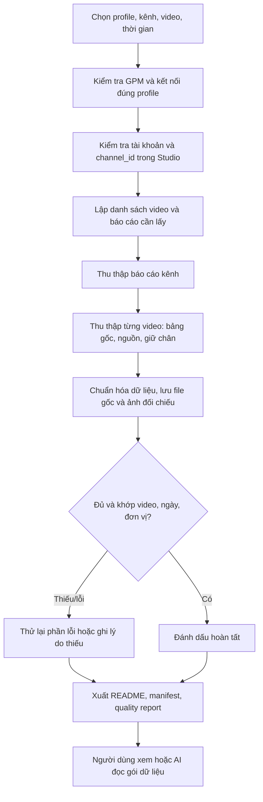

# Thiết kế tool lấy dữ liệu YouTube Studio qua GPM

**Trạng thái:** Tài liệu thiết kế, chưa triển khai.  
**Mục tiêu:** Một lần chạy thu thập dữ liệu kênh và từng video, tạo bộ file dễ xem cho người dùng và dễ đọc, kiểm chứng cho AI phân tích.  
**Ràng buộc:** Mọi thao tác trình duyệt dùng đúng profile GPM đã chọn; không khởi chạy Chrome/Edge riêng. Tool chỉ đọc và xuất dữ liệu, không sửa nội dung hoặc cài đặt kênh.

## 1. Trải nghiệm mong muốn

Người dùng mở GPM và đăng nhập YouTube Studio như thường lệ. Sau đó mở tool, chọn profile, kênh, phạm vi video và mẫu thời gian, rồi bấm **Thu thập**. Tool tự đi qua các báo cáo, lưu dữ liệu, kiểm tra thiếu sót và hiển thị kết quả. Lần sau có thể bấm **Chạy lại cấu hình gần nhất**.

Một lệnh gọi từ AI cũng dùng cùng quy trình này. Muốn AI tự khởi chạy, phiên AI phải truy cập được tool cục bộ trên **máy đang chạy GPM**; chỉ viết một skill hướng dẫn bằng văn bản sẽ không tự tạo ra quyền điều khiển máy.

## 2. Kiến trúc và công nghệ đề xuất

| Thành phần | Công nghệ đề xuất | Vai trò |
|---|---|---|
| Giao diện Windows | Python + PySide6 | Cửa sổ chọn profile/kênh/video, xem tiến độ và mở kết quả. Không cần thêm trình duyệt. |
| Kết nối GPM | Local API của GPM qua `httpx` | Liệt kê profile, khởi động/nhận địa chỉ điều khiển profile đã chọn. Không đọc hay sao chép cookie. |
| Robot YouTube Studio | Playwright Python kết nối qua CDP | Điều khiển **trình duyệt thuộc profile GPM**: mở trang, chọn bộ lọc, xuất file, chụp biểu đồ. |
| Chuẩn hóa dữ liệu | Python + `openpyxl`/`pandas` + `pydantic` | Đọc file xuất, đổi về tên cột và đơn vị ổn định, kiểm tra kiểu dữ liệu. |
| Lưu trữ | Thư mục mỗi lần chạy; SQLite cho lịch sử/cấu hình | Giữ file gốc và file chuẩn hóa; hỗ trợ chạy lại, theo dõi lỗi. |
| Cầu nối cho AI, giai đoạn sau | CLI hoặc MCP server cục bộ gọi cùng lõi thu thập | Cho AI gọi `list_profiles`, `collect`, `get_status`, `read_summary` thay vì bấm giao diện. |

**Vì sao chọn cấu trúc này:** Python tiện xử lý các workbook YouTube Studio và dữ liệu phân tích hiện có. Playwright thực hiện thao tác lặp lại; AI chỉ chọn nhiệm vụ và phân tích kết quả. Giao diện tách khỏi lõi robot để sau này thêm cầu nối AI mà không viết lại logic thu thập.

Luồng kỹ thuật: tool gọi API cục bộ của GPM để mở profile và nhận cổng CDP; Playwright kết nối qua cổng đó. Nếu profile đã mở, bộ kết nối phải kiểm tra trạng thái và chỉ tiếp tục khi lấy được endpoint của **đúng profile**, không tạo profile mới hay mở Chromium mặc định. Cách kết nối khi profile đang mở cần kiểm thử với phiên bản GPM cài trên máy trước khi chốt triển khai.

## 3. Input: ít lựa chọn, nhưng đủ chính xác

### Màn hình chính

| Trường | Mặc định / cách chọn | Ý nghĩa |
|---|---|---|
| Profile GPM | Danh sách lấy từ GPM; nhớ profile dùng gần nhất | Bắt buộc; hiển thị tên profile, không bắt người dùng nhập ID. |
| Kênh YouTube | Tự phát hiện sau khi vào Studio; xác nhận tên và `channel_id` | Bắt buộc đối chiếu để tránh lấy nhầm kênh khi một tài khoản quản lý nhiều kênh. |
| Video | **Tất cả video dài đã xuất bản**; hoặc chọn trong danh sách tìm kiếm/tích chọn | Có thể chọn 1 video, nhiều video, hoặc toàn bộ. Shorts/Live là loại nội dung riêng. |
| Khoảng thời gian | **28 ngày**, 90 ngày, tùy chọn ngày bắt đầu/kết thúc | Cửa sổ lịch giống nhau cho báo cáo tổng hợp. |
| Mốc theo tuổi video | **D0–D3 theo ngày lịch**, D0–D6; tùy chọn nếu có dữ liệu | Để so video ở tuổi tương đương. Không gọi D0–D3 là “đúng 96 giờ”. |
| Mức thu thập | **Tiêu chuẩn**, Nhanh, Đầy đủ | Quy định số báo cáo và ảnh cần lấy. |
| Nơi lưu | Thư mục `runs/` trong thư mục tool; cho phép đổi | Mỗi lần chạy tạo một thư mục riêng. |

**Nút bấm:** `Kiểm tra kết nối` → `Thu thập` → `Mở kết quả`; có `Tạm dừng`, `Tiếp tục`, `Chạy lại phần lỗi`. Trước khi chạy, hiển thị tóm tắt: “Profile X • Kênh Y • 8 video • 28 ngày • Tiêu chuẩn”.

### Mức thu thập

| Mức | Lấy gì | Khi nào dùng |
|---|---|---|
| Nhanh | Tổng quan kênh, bảng video, lượt xem và nguồn truy cập chính | Kiểm tra định kỳ. |
| **Tiêu chuẩn** | Mức Nhanh + Reach, Engagement, Đề xuất/Tìm kiếm theo từng video, giữ chân nếu có, mốc tuổi video | Mặc định cho phân tích kênh và chọn video tiếp theo. |
| Đầy đủ | Mức Tiêu chuẩn + ảnh đối chiếu các trang, bảng chi tiết nguồn, lịch sử theo ngày và metadata bổ sung | Điều tra một video hoặc cần kiểm chứng sâu. |

### Tùy chọn nâng cao

- Chỉ lấy video mới hoặc video có dữ liệu thay đổi kể từ lần chạy trước.
- Số video xử lý tối đa mỗi lần; chọn thêm video trọng tâm để lấy mức Đầy đủ.
- Giữ file gốc, giữ ảnh đối chiếu, ẩn số liệu doanh thu. **Mặc định không thu doanh thu**.
- Giới hạn tốc độ thao tác và số lần thử lại khi Studio tải chậm.
- Múi giờ báo cáo ghi rõ; mặc định dùng múi giờ thể hiện trong Studio, kèm thời điểm chạy ISO 8601.

## 4. Dữ liệu cần lấy

| Nhóm | Dữ liệu ưu tiên | Nguồn trong Studio |
|---|---|---|
| Danh mục video | `video_id`, tiêu đề gốc, ngày/giờ đăng, thời lượng, loại video, URL | Danh sách video/chi tiết video. |
| Kênh | Views, watch time, subscribers gained/lost nếu có, phân bố nguồn truy cập | Analytics tổng quan/chế độ nâng cao. |
| Hiệu suất video | Views, impressions, CTR, average view duration, average percentage viewed, watch time | Analytics từng video, Reach/Engagement và báo cáo xuất. |
| Nguồn truy cập | Browse features, Suggested videos, YouTube Search và các nguồn khác; lượt xem, watch time/AVD, impressions/CTR **nếu Studio hiển thị cho nguồn đó** | Bảng nguồn truy cập. |
| Chi tiết đề xuất/tìm kiếm | Video nào đề xuất video của mình; từ khóa tìm kiếm; số liệu từng dòng có sẵn | Báo cáo chi tiết từng nguồn. |
| Giữ chân | Đường cong hoặc các mốc nhìn thấy được; ảnh biểu đồ có gắn video và khoảng ngày | Engagement/retention. |
| Theo ngày | Chuỗi views, impressions, CTR, AVD hoặc watch time nếu có | Báo cáo ngày/biểu đồ xuất được. |

Danh sách trên là **mục tiêu thu thập**, không phải cam kết Studio luôn cung cấp mọi ô dữ liệu. Nếu một chỉ số bị ẩn, không đủ mẫu hoặc không xuất được, lưu `null` cùng lý do `not_available`/`not_exportable`; không tự suy diễn con số từ ảnh. Ưu tiên **file xuất gốc → bảng hiển thị có cấu trúc → ảnh làm bằng chứng**. Ảnh không thay thế bảng số liệu khi bảng có thể xuất.

## 5. Output: hai lớp cho người và AI

Mỗi lần chạy tạo một gói độc lập, ví dụ:

```text
runs/2026-10-03_kenh-phap_28d/
├── README.md                 # Báo cáo dễ đọc: kênh, phạm vi, số video, đủ/thiếu
├── manifest.json             # ID lần chạy, cấu hình, thời gian, phiên bản schema, trạng thái
├── quality_report.json       # Cảnh báo và lỗi theo video/báo cáo
├── data/
│   ├── channel.json          # Chỉ số tổng quan, kèm nguồn và khoảng ngày
│   ├── videos.csv            # Một dòng/video, dễ mở bằng Excel
│   ├── videos.jsonl          # Một object/video, dễ cho AI đọc
│   ├── traffic_sources.csv   # Một dòng/video/nguồn/khoảng ngày
│   ├── suggested_videos.csv  # Một dòng/video đích/video nguồn/khoảng ngày
│   ├── search_terms.csv      # Một dòng/video/từ khóa/khoảng ngày
│   ├── daily_metrics.csv     # Một dòng/video/ngày
│   └── retention/            # Dữ liệu điểm giữ chân nếu xuất được
├── raw/                      # File XLSX/CSV gốc từ Studio, không sửa
└── evidence/                 # Ảnh các biểu đồ/trang cần đối chiếu
```

**`README.md` cho người dùng** có bảng “Đã lấy / Thiếu / Cần đăng nhập lại”, liên kết tương đối đến file và ghi rõ dữ liệu đến ngày nào. **CSV/JSONL cho AI** giữ nguyên đơn vị số, ID và khóa liên kết; không dùng tên file kiểu `video1.xlsx` làm định danh chính.

Mỗi bản ghi chuẩn hóa cần có tối thiểu:

```json
{
  "channel_id": "UC...",
  "video_id": "VIDEO_ID_VI_DU",
  "video_title": "Tiêu đề ví dụ",
  "period_start": "2026-09-01",
  "period_end": "2026-09-28",
  "period_kind": "fixed_calendar_range",
  "views": 250,
  "impressions": 3000,
  "ctr_percent": 2.5,
  "average_view_duration_seconds": 900,
  "status": "ok",
  "source_file": "raw/video_VIDEO_ID_VI_DU_reach.xlsx"
}
```

**Các số trên là dữ liệu giả lập để minh họa cấu trúc.** Khi triển khai, tool chỉ được ghi một bản ghi như vậy nếu từng giá trị thực sự cùng khoảng ngày và cùng nguồn báo cáo; nếu không phải tách bản ghi/đặt `null` và báo lỗi đối chiếu. Mọi tỷ lệ dùng đơn vị `%` rõ ràng; AVD dùng giây. Không lấy trung bình CTR của các dòng nguồn để làm CTR tổng.

Để nối với dữ liệu `analysis/channel-win` hiện có, `video_id` là khóa chung. Gói thu thập **không tự ghi đè** `channel_state.json`, `evidence_inventory.json` hay nhận định cũ; phần phân tích cập nhật các file đó ở bước riêng.

## 6. Workflow một lần chạy



Chi tiết vận hành:

1. **Kiểm tra trước:** GPM đang chạy, profile tồn tại, tool kết nối được đúng trình duyệt; Studio đã đăng nhập và `channel_id` khớp lựa chọn.
2. **Lập kế hoạch:** phát hiện danh sách video, tính khoảng ngày hợp lệ và tạo checklist báo cáo. Nếu video mới chưa có đủ D0–D3 thì gắn `insufficient_age`.
3. **Thu thập:** mở lần lượt báo cáo kênh và từng video, chọn khoảng ngày, chờ dữ liệu tải xong, xuất bảng hoặc chụp ảnh khi cần. Lưu file ngay với `video_id` và loại báo cáo trong tên.
4. **Chuẩn hóa:** đọc file gốc, nhận diện cột theo tên báo cáo/ngôn ngữ giao diện, chuyển số/đơn vị, lưu CSV/JSONL. Mỗi chỉ số gắn đường dẫn tới file nguồn.
5. **Kiểm tra:** đối chiếu `channel_id`, `video_id`, ngày, dòng Tổng, số dòng và file tải thành công. Không gộp các snapshot khác tuổi video. Báo cáo có giới hạn số dòng phải được chia phạm vi hoặc đánh dấu `truncated`.
6. **Kết thúc:** tạo `README.md` và `quality_report.json`, hiển thị số mục hoàn tất/thất bại. Chạy lại chỉ các mục lỗi mà không xóa dữ liệu hợp lệ.

## 7. Quy tắc độ chính xác và xử lý lỗi

- **Đúng kênh trước khi lấy số:** đọc tên và `channel_id` trong Studio. Nếu không khớp, dừng và yêu cầu người dùng chọn đúng kênh.
- **Đúng khoảng ngày:** ghi ngày bắt đầu/kết thúc *của từng báo cáo*, thời điểm tải và múi giờ. Cửa sổ theo ngày lịch và cửa sổ đúng 48/96 giờ là hai loại khác nhau; không đánh tráo.
- **Giữ dữ liệu gốc:** file XLSX/CSV gốc và ảnh đối chiếu không bị sửa. File chuẩn hóa có `source_file`, `source_sheet` hoặc URL/trang tương ứng khi có thể.
- **Dữ liệu trống:** phân biệt `zero` (YouTube báo 0), `not_available` (không hiển thị), `not_exportable` (không xuất được), `failed` (robot lỗi) và `not_collected` (không chọn lấy).
- **Giao diện thay đổi:** robot dùng nhãn/role và kiểm tra màn hình trước khi bấm; nếu không tìm thấy thành phần thì dừng mục đó, chụp ảnh lỗi, không bấm mò.
- **Đăng nhập/CAPTCHA:** dừng và báo người dùng xử lý trong chính GPM; sau đó tiếp tục từ checkpoint. Không lưu mật khẩu, cookie hay token vào gói output.
- **Tốc độ:** xử lý tuần tự một profile/kênh để tránh xung đột tab và download; chờ có điều kiện thay vì chờ số giây cố định; thử lại có giới hạn.
- **Bảo mật cục bộ:** giao diện/cầu nối AI chỉ nghe trên `127.0.0.1`; không công khai cổng điều khiển GPM; gói dữ liệu không chứa thông tin đăng nhập.

## 8. Giai đoạn xây dựng

1. **MVP:** Giao diện chọn profile và kênh; 1–10 video dài; 28 ngày; xuất báo cáo tổng quan, hiệu suất video, nguồn truy cập; tạo `README.md`, CSV/JSONL, manifest và báo lỗi.
2. **Bổ sung dữ liệu sâu:** Đề xuất/Tìm kiếm chi tiết, retention, D0–D3/D0–D6, ảnh đối chiếu và chạy lại phần lỗi. Kiểm thử với workbook cũ và các trang Studio thực tế của kênh.
3. **Kết nối AI:** Thêm CLI/MCP cục bộ để mình gọi cùng lõi thu thập bằng câu lệnh, đọc trạng thái và mở gói dữ liệu ngay trong phiên làm việc. Skill lúc này hướng dẫn mình **khi nào gọi tool và cách đọc output**, không thay thế robot.

**Điều kiện nghiệm thu MVP:** chọn đúng profile/kênh; không mở trình duyệt khác; thu thập được cùng khoảng ngày cho các video đã chọn; mỗi số liệu truy được file nguồn; báo rõ các mục thiếu/lỗi; chạy lại không tạo số liệu trùng; người dùng mở `README.md` hiểu ngay đã lấy gì và AI đọc được CSV/JSONL mà không đoán cấu trúc workbook.

## 9. Cấu trúc thư mục source code

Đây là **cấu trúc đích để triển khai**, chưa phải các thư mục đã được tạo. Mã nguồn nằm trong `src/`; `runs/` và `state/` chỉ chứa dữ liệu lúc chạy.

```text
Tool_LayDuLieu_YTB_GPM/
├── KIEN_TRUC_TOOL_LAY_DU_LIEU_YTB_GPM.md
├── README.md                         # Cách cài, chạy, xử lý lỗi
├── pyproject.toml                    # Dependency và lệnh chạy
├── src/ytb_gpm_collector/
│   ├── __main__.py                    # Khởi động ứng dụng
│   ├── config.py                      # Cấu hình mặc định, đường dẫn
│   ├── domain/                        # Hợp đồng dữ liệu, không phụ thuộc GPM/UI
│   │   ├── models.py                  # Input, output, trạng thái, schema_version
│   │   └── errors.py                  # Các lỗi có mã rõ ràng
│   ├── application/                   # Quy trình nghiệp vụ
│   │   ├── plan.py                    # Chọn video, mốc ngày, danh sách báo cáo
│   │   └── collect.py                 # Chạy kế hoạch, checkpoint, retry
│   ├── integrations/                  # Làm việc với hệ thống bên ngoài
│   │   ├── gpm/client.py              # Local API, profile, cổng CDP
│   │   ├── studio/
│   │   │   ├── session.py             # Playwright kết nối đúng profile GPM
│   │   │   ├── pages/                 # Thao tác trang; selector nằm tại đây
│   │   │   │   ├── videos.py          # Danh sách và nhận diện video
│   │   │   │   └── analytics.py       # Bộ lọc ngày, tab, nút xuất
│   │   │   └── reports/               # Mỗi loại báo cáo một module
│   │   │       ├── channel.py         # Tổng quan kênh
│   │   │       ├── video.py           # Reach/Engagement từng video
│   │   │       ├── traffic.py         # Nguồn truy cập, đề xuất, tìm kiếm
│   │   │       └── retention.py       # Đường giữ chân/ảnh biểu đồ
│   │   ├── exports/
│   │   │   ├── readers.py             # Đọc XLSX/CSV gốc theo định dạng
│   │   │   ├── normalize.py           # Tên cột, đơn vị, khóa video/ngày
│   │   │   └── validate.py            # Kiểm tra thiếu/trùng/sai phạm vi
│   │   └── storage/
│   │       ├── runs.py                # Ghi raw, data, evidence, manifest
│   │       └── history.py             # SQLite cấu hình và lịch sử chạy
│   └── interfaces/                    # Các cách gọi cùng một quy trình
│       ├── desktop/window.py          # Giao diện Windows
│       ├── cli.py                     # Dòng lệnh
│       └── mcp.py                     # Cầu nối AI, giai đoạn 3
├── tests/
│   ├── fixtures/                      # File Studio mẫu đã xóa dữ liệu nhạy cảm
│   ├── test_exports.py                # Đọc/chuẩn hóa/kiểm tra dữ liệu
│   └── test_collect.py                # Kế hoạch, resume, lỗi có thể thử lại
├── state/                             # SQLite/cấu hình; không đưa lên Git
└── runs/                              # Output từng lần chạy; không đưa lên Git
```

**Ranh giới khi sửa và nâng cấp:**

- `interfaces → application → domain`; `application` gọi `integrations`. `domain` không import các tầng khác. Giao diện Desktop, CLI và MCP **cùng gọi** `application/collect.py`, không có ba robot khác nhau.
- Đổi giao diện YouTube Studio: sửa `studio/pages/`. Thêm loại báo cáo: thêm module trong `studio/reports/`, quy tắc đọc file ở `exports/` và kiểm thử tương ứng; không nhét tất cả vào một `collector.py` lớn.
- Đổi định dạng output: sửa `domain/models.py`, `exports/normalize.py`, `storage/runs.py`; tăng `schema_version` và giữ khả năng đọc gói dữ liệu cũ nếu cần.
- `runs/` và `state/` nằm ngoài `src/`, không lưu mật khẩu, cookie hoặc token. Các file `retention.py`, `mcp.py` và module chưa thuộc MVP chỉ tạo khi triển khai tới giai đoạn tương ứng.

## Tài liệu kỹ thuật tham khảo

- [GPM Login Local API](https://gpmlogin.com/doc): mở profile và nhận thông tin kết nối automation.
- [YouTube Studio Advanced Mode](https://support.google.com/youtube/answer/9717005?hl=en-EN): chọn bộ lọc, lưu chế độ xem và xuất báo cáo; bản xuất hiện có giới hạn số dòng.
- [Playwright kết nối qua CDP](https://playwright.dev/python/docs/api/class-browsertype#browser-type-connect-over-cdp): kết nối vào trình duyệt Chromium đang chạy.

Các nút và vị trí trong YouTube Studio có thể khác theo đợt cập nhật giao diện. Bản triển khai phải kiểm tra thực tế trên profile GPM và giao diện Studio của kênh trước khi cố định danh sách báo cáo có thể tự động lấy.
